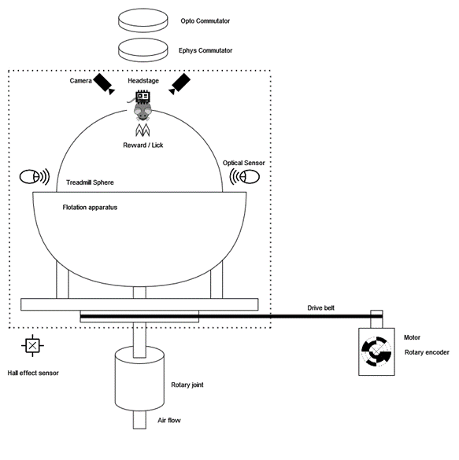
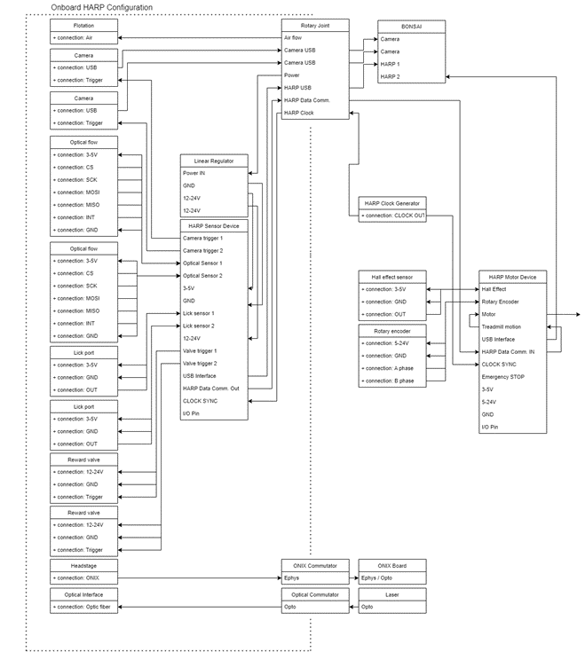

# Vestibular VR Design Document
## Summary
* Device for open-loop or closed-loop vestibular stimulation in head-fixed mice. 
* Can be combined with physiological and behavioural recording modalities, optogenetic stimulation.
* Modular, low-cost, open-source.

## Principal Requirements
* Accurately track mouse movement on the 3D treadmill.
    - Animal is head-fixed on a polystyrene sphere kept afloat with compressed air (3D treadmill).
    - Optical sensors measure movement induced on the treadmill to report mouse directional/rotational movement. Mouse movement should be tracked with a spatial resolution of **0.1o** and latency of ~~XXXX~~.
* Control of vestibular platform rotation.
    - The rotary platform is actuated by a (stepper) motor using a timing belt. The platform can be rotated with a variable latency coupled to screen update rate for VR and resolution of **0.1o**.
    - An incremental encoder is coupled with the motor shaft to provide feedback about the angular position.
    - Hall effect sensors are used for homing purposes.
    - There is an emergency stop button which should immediately halt any movement of the platform.
    - The weight on board the rotary platform is **up to 2kg** and requires a motor with ~~specs~~.
* Closed-loop and open-loop
    - In closed-loop mode, the rotation of the treadmill is fed back to the motor to control rotation. The round trip latency of motion --> motor feedback is < ~~XXXX~~. The gain of the feedback in closed-loop mode can be adjusted by the experimenter.
    - In open-loop mode, rotation of the platform is independent from treadmill movement and is experimenter controlled.
* Signal output
    - As the rotary platform rotates independently of the rest of the assembly, any signals that are sent to / captured on the rotary platform must be passed through a rotary joint tied to the rotation of the platform (to avoid signal cable twisting). These signals may comprise USB, analog, power, digital, coaxial etc.
    - At minimum, the rotary joint should allow for transmission of signals from:
        * Eye tracking camera
        * Lick detection ports
        * Reward delivery ports
        * Ephys / optical probes
        * Optical sensors to monitor treadmill movement
        * Air flow for treadmill flotation
    - Ideally there should also be flexibility in adding / removing sensors.
* VR
    - The setup is surrounded by 4 static screens providing a complete VR surround of the assembly.
    - Lateral motion is used to update VR position.
    - (Image warp to correct for pixel position?)
* Experiment design
    - Bonsai can be used to design behavioural experiments, modulate closed-loop and open-loop behaviour, drive VR environment.

## Design Diagram
The primary design constraint on the system is the busing of signals from the rotary platform (within dotted lines) to the stationary part of the system. This is achieved with a rotary joint with the rotor linked to the platform movement. The rotary joint must also include a through-hole or hydraulic union to allow airflow to the flotation platform of the treadmill sphere.

For some sensors onboard the rotary platform it is desirable to integrate their outputs close to the sensors themselves (e.g. optical sensors with I2C/SPI protocol). For this reason - and generally to standardise the signal protocols being sent through the rotary joint – a HARP device will be present on the rotary platform to integrate the majority of the sensors into a single USB output. The rotary joint can therefore deal almost exclusively with USB signals from the cameras and HARP device. This onboard HARP device will interface with an off-platform secondary HARP device that will integrate signals from the rotary platform and off-platform sensors (hall effect, rotary encoder) and ultimately drive the platform motor. These 2 HARP devices must also have a means of synchronising their sample clocks.

## Rotary Joint Requirements
Given these requirements, the primary rotary joint must allow for passage of the following signals:
- 1x USB for HARP sensor device
- 1x USB for camera 1
- 1x USB for camera 2
- 2x signal lines for HARP  HARP communication
- 1x signal line for HARP sync clock signal
- 1x line for common GND
- 1x line for power
- (Optional) 2x USB for gaming mouse sensors, alternative to optical flow sensors

In total, 5x USB2 and 5 power / signal lines.
In addition, the system should accommodate recording of ephys signals via an ONIX interface and an optical path for e.g. optogenetic stimulation. These signals must also be commutated off the rotary platform.

## Signal Routing

